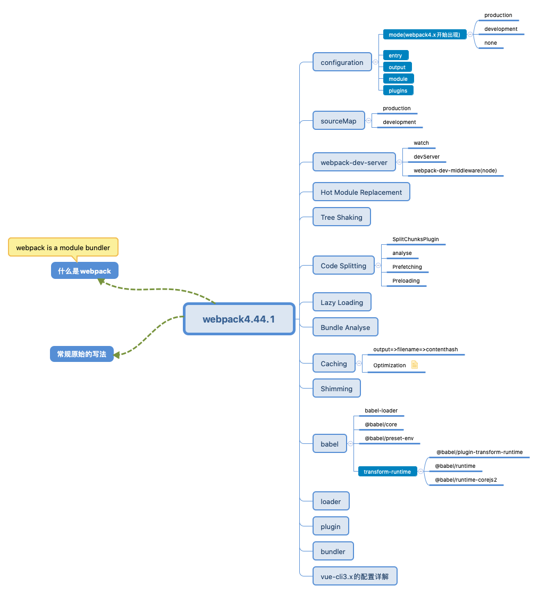
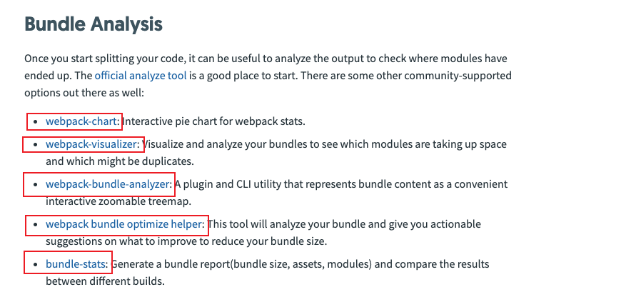
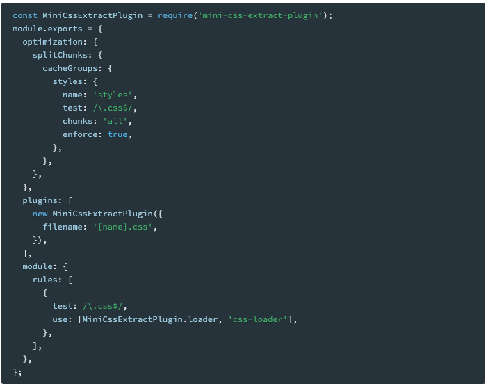
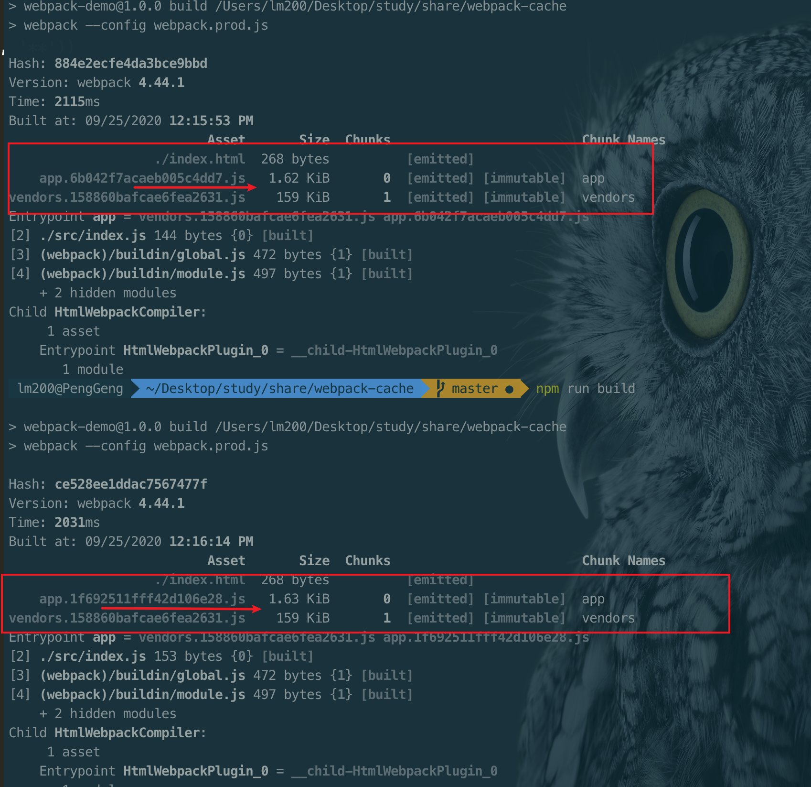
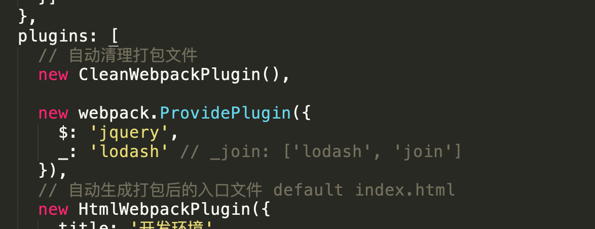
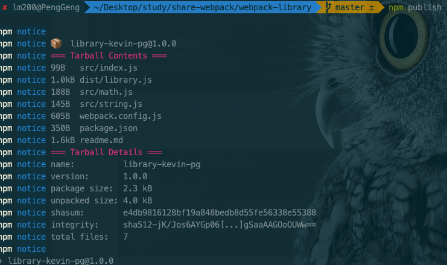
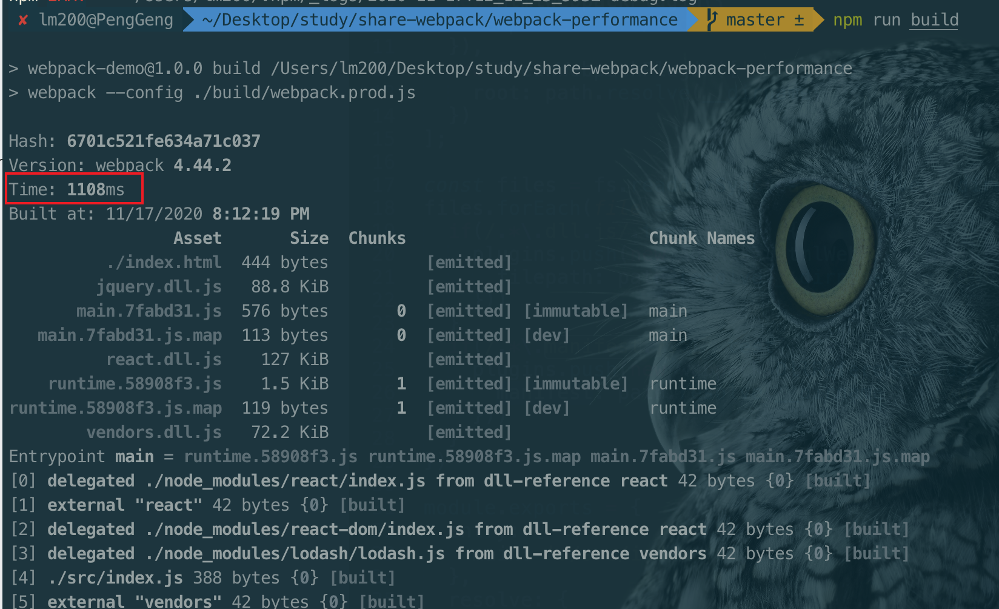
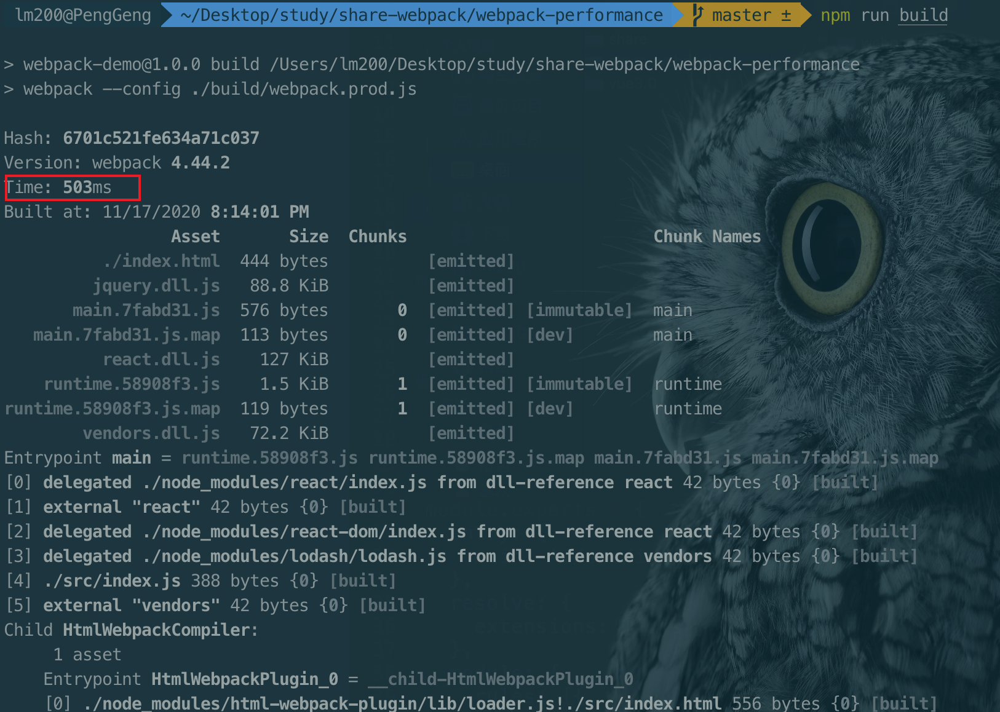

#<center>Webpack</center>
<div align='right'><font size='4' color='blue'>Author: Peng Geng</font></div>
## 1. webpack分享图谱


## 2. 原始写法和模块化写法
### 2.1 原始写法
* **touch index.html**
 
```javascript
// 举个例子🌰 demo-01
<div id='root'>
  <script src='./index.js'></script>
<div>

```
* **touch index.js**

```javascript
// 举个例子🌰 demo-01
const root = document.getElementById('id')
let El = document.creteateElement('div')
El.innerText = 'Peng Geng'
root.append(El)

```

### 2.1. 模块化写法 
> **ES Module**

* touch one.js

```javascript
// 举个例子🌰 `demo-01`
function One() {
	const root = document.getElementById('root')
	let one = document.createElement('div')
	one.innerText = 'Peng Geng'
	root.append(one)
}
export default One
```
* 修改原生写法 index.js

```javascript
// 举个例子🌰
import one from './one.js'
new one()
```
> **CommonJS**  <font color='red'>`自行做实验` `require 、module.exports`</font> 


## 2. what’s [webpack](https://webpack.js.org/)
### **webapck is a module bundler**
>1. 什么是模块打包工具
>
>2. 打包工具有哪些  <font color='blue'>`gulp、 grunt、 webapck`</font>
>
>3. webpack 支持的模式 <font color='blue'>` ES Module、CommonJS、AMD、CMD `</font>
>
>4. 查看webpack版本信息 `npx info webapck`
>
>5. npx webpack `index.js` 需要打包的入口

## 3.  Configuration
### 3.1. mode  `webpack-demo02`
注：<font color='blue'>`mode` </font>在webpack4.x 的版本添加mode的属性
> **设置mode**

```js
// 举个例子🌰
module.export = {
  mode: 'production'
}
或者
运行命令
webpck --mode=production
```
* **production**

  在打包的过程中如果没有谁知mode的值，默认会是<font color='blue'>`production`</font>,webpack 自己会做很多优化
  

* **development**

  在打包的过程中mode的只，会设置为<font color='blue'>`development`</font>,启用 `NamedChunksPlugin` 和 `NamedModulesPlugin`。<br>
  
  
* **none**
  不做任何优化处理<br>
  


### 3.2. entry 
* **单入口语法** `entry: string|Array<string>`

```js
// 举个例子🌰 `webapck-demo02`
module.exports = {
  entry: './index.js'
}

或者

module.exports = {
  entry: {
   main: './index.js'
 }
}
```
* **对象语法** `entry: {[entryChunkName: string]: string|Array<string>}`

```js
// 举个例子🌰
  module.exports = {
    entry: {
      main: './index.js',
      one: './one.js',
      two: './two.js'
    }
  }
```
>  **<font color='red'>注:</font>**  webpack小于<font color='red'>4.x</font>的时候，一般抽离的vendor作为单独的包来添加到起点`entry`的配置中，然后结合 `CommonsChunkPlugin `一起使用；但在4.x的版本中优化了次选项配置，而是使用`optimization.splitChunks`选项，将vender和主入口配置分开，作为单独的一个文件。

### 3.3. output
* **`publicPath`**

>1. 指定在浏览器中所引用的输出目录对应外部用户的公开URL
>
>2. 此选项在去加载一些绝对路径的协议是活着相对路径可能会用到
>
>3. 比如：资源托管到`CDN`时，此时就必须要用到了

```js
// 举个例子🌰 `webapck-demo02`
output: {
  publicPath: '/assets/',
  chunkFilename: '[name].chunk.js'
}
// 此时页面加载的资源(js/png/css)为
/assets/*.js
background-image: url(/assets/*.png);

CDN:
output: {
  publicPath: https://www.cdn.com/',
  chunkFilename: '[name].chunk.js'
}
// index.html script src='https://www.cdn.com/[name].chunk.js'
```

* **`path`**

>1. 打包输出的路径  默认：<font color='red'>当前路径下的 `dist/` </font>

>2.  通常我们会设置打包路径为： <font color='red'>`path.resolve(__dirname, 'dist')`</font>

```js
// 举个例子🌰 `webapck-demo02`
const path = require('path')
module.exports = {
  output: {
    path: path.resolve(__dirname, 'dist')
  }
}
```

* **`filename`** [<font size=4>**filename配置**</font>](https://v4.webpack.js.org/configuration/output/#outputfilename)

>1. 确定输出文件的每个bundle的名字，此时会打包到<font color='blue'>`output.path`</font>对应的目录下面
>
>2. 对应单个入口的时候，此时<font color='blue'>`output.filename`</font>的值可以为<font color='blue'>`静态`</font>名称
>
>3. 一般项目的模块会很多，我们需要做动态的配置来使每个模块有对应的bundle名称


```js
 // 举个例子🌰
 module.exports = {
  filename: [name].[chunkhash:7].js
 }
```

* **`chunkFilename`**

>1. 确定非入口文件输出的 chunk 文件名称  <font color='red'>`非 entry`</font>
>2. 配置 <font color='blue'>`[name].[contenthash].js` </font>可以监听文件的变化打包时可以改变hash，如果没有改变则hash不变,后面会具体讲到 `contenthash`的作用


```js
 // 举个例子🌰
 module.exports = {
  chunkFilename: [name].[contenthash:7].js
 }
```

### 3.4. module

>* 决定如何处理项目中不同的类型的模块
>
>* <font color='blue'>`module.rules`</font> 创建模块时，匹配到的规则能够修改模块的创建方式。这些规则能够对模块（module）应用loader，或者修改解析器(parser)
>
>* <font color='blue'>`Rule.test`</font> 引用所有通过断言测试的模块, 通过test的正则做匹配合适的loader去做解析
>
>* <font color='blue'>`Rule.use`</font> 如果是需要多个loader来解析时，我们需要使用`use`以数组的形式表示如：<font color='red'> `use: ['style-loader', 'css-loader']`;</font> 如果匹配到的模块仅需要单个loader来解析时，可以直接使用<font color='red'>`loader: 'file-loader'`</font>;
>> <font color='red'>注：</font> Loaders 可以通过多个loaders已达到链式调用的效果，它们会从右到左被应用（从最后到最先配置）如：<font color='red'>`style-loader<css-loader<less-loader/sass-loader<postcss-loader`</font>
> 
>* <font color='blue'>`Rule.exclude`</font> 抛开一些不需要使用此loader解析的模块； 如：`node-module`
>
>* <font color='blue'>`Rule.include`</font> 指定设置一些需要使用此loader解析的模块； 如：`a.js`

<font color=red size=4>注：`options.modules=true`</font>

```js
 // 举个例子🌰 `webpack-demo3`
module: {
  rules: [{
    test: '/\.css$/',
    use: ['style-loader', 'css-loader', 'postcss-loader']
  },
  {
    test: '/\.(png|gif|jpg|svg)/',
    loader: 'file-loader', // url-loader
    options: {
      name: [name]_[hash].[ext],
or
      name(file) {
        if(process.env.NODE_ENV === 'development') {
        	return '[path][name].[ext]'
        }
        return '[hash].[ext]'
      },
      outputPath: 'images/',
      limit: 1024*20
    }
  }]
}

// 针对css文件的导入另一个css文件，如果我们需要把引入的文件从下到上去用loader 解析需要修改配置 [importLoader]
 use: ['style-loader',
  {
   loader: 'css-loader',
   importLoaders: 1,
   options: {
     modules: true // 模块化样式，文件使用的样式不会有耦合的情况
   }
 } ,
 'postcss-loader']

```

> <font color=blue>style-loader
> 把翻译的css的文件挂在到HTML的header部分

> css-loader
> 会分析我们css文件中的关系来合并css文件

> scss-loader/less-loader/stylus-loader
> 把 `*.sass/less` 的文件编译成css文件
> 
> postcss-loader
> 浏览器的兼容
> css-loader 是有执行顺序的 从下到上从右到左 </font>
> 
> <font size='4' color='red'>注: [`postcss-loader`](https://v4.webpack.docschina.org/loaders/postcss-loader/)</font>、 <font size='4' color='red'>[`autoprefixer`](https://github.com/postcss/autoprefixer) </font>
> 
> 此时需要在`webpack.config.js` 同级目录创建touch `postcss.config.js` , 添加如下

```js
// 举个例子🌰 `webpack-demo3`
// 需要 npm install autoprefixer -D
module.exports = {
  plugins: [
    require('autoprefixer')
  ]
}
// 有些浏览器比较新的还需要做些处理,才会显示
"browserslist": [
    "> 1%",
    "last 2 versions",
    "not ie <= 8"
  ]
```

### 3.5. plugins
>* <font size='4'>[HtmlWebpackPlugin](https://github.com/jantimon/html-webpack-plugin)</font> <font color='blue'>: 会自动在打包文件里生成一个index.html 文件，并把打包生成的文件自动引入到dist文件中;
`index.html 文件是何时生成的? ` 其实plugin在打包完成后会有一些生命周期函数的钩子，然后可以处理一些特定的事情。此时的index.html就在此时创建</font>
>
>> 
```js
// 举个例子🌰 `webpack-demo05`
const HtmlWebpackPlugin = require('html-webpack-plugin')
plugins:[
  new HtmlWebpackPlugin({
  	title: '你的title',
  	template: '你自己的模版' // './index.html'如果不填写 默认会自动生成index.html
  })
]
```
>> 

>* <font size='4'>[CleanWebpackPlugin](https://github.com/johnagan/clean-webpack-plugin)</font>
>
>>
```js
 // 此插件根据版本的变化会写法上会有一定的变化
 // V3.0.0 如下：
 const { CleanWebpackPlugin } = require('clean-webpack-plugin')
 plugins: [
 	new CleanWebpackPlugin() // 默认会从你的oupu.path 来删除 在打包之前
 ]
 // V1.0.0
 const CleanWebpackPlugin = require('clean-webpack-plugin')
 plugins: [
 	new CleanWebpackPlugin(path, options) // 【path】 clean 路径；【options】配置
 ]
```
>> 
>
>* ExtractTextPlugin
>* HotModuleReplacementPlugin
>* SplitChunksPlugin

## SourceMap

>* <font color='blue'>`cheap`: </font>提示错误文件在哪一行 反之则不会告诉你列
>
>*  <font color='blue'>`module`: </font> 增加错误的module 提示 比如使用的一些loader plugins
>
>*  <font color='blue'>`inline`: </font> 生成的映射文件包含在打包的chunk 文件中，反之单独生产 `[chunkname].map.js`文件
>
>*  <font color='blue'>`eval`: </font>是生产eval的执行文件，是最快的
>
>*  <font color='blue'>`source-map`: </font> 生成`[chunkname].map.js` chunk的映射文件
>
>* **deveplopment**建议使用: `cheap-module-eval-source-map` 提示的错误比较全并且相对的打包速度比较快
>
>*  **production** 建议使用如果线上有遇到问题可以设置为：`cheap-module-souce-map` 或者直接不设置
> * **SourceMap** 原理： [资料1](https://segmentfault.com/a/1190000008315937)、[资料2](https://www.html5rocks.com/en/tutorials/developertools/sourcemaps/)、[资料3](http://www.ruanyifeng.com/blog/2013/01/javascript_source_map.html)、[资料4](https://www.youtube.com/watch?v=NkVes0UMe9Y)

```js
//  举个例子🌰 `webpack-demo06`
module.exports = {
  // development
  devtool: 'cheap-moudle-eval-source-map'
  // production
  devtool: 'cheap-module-source-map' // 或者不填
}
```

## webpack-dev-server
>* watch <font color='blue'>此功能可以监听代码的改变,但是改变后的内容需要手动刷新页面才会生效</font>
>
>> ```js
>> 
>> // 举个例子🌰 `webpack-demo07`
>> 命令行使用: npx webpack --watch
>> or
>> package.json -> script -> watch: webpack --watch
>> 
>> ```
>
>* [devServer](https://webpack.js.org/configuration/dev-server/) 需要依赖webpack-dev-server; 使用 [webpack-dev-server](https://webpack.js.org/guides/development/#using-webpack-dev-server)
>
>> ```js
>> 
>>  第一步: npm install webpack-dev-serve
>>  第二步: 在webpack.config.js 创建devServe的配置
>>  devServer: {
>>    contentBase: './dist',
>>    port: '9999',
>>    open: true,
>>    proxy: {
>>      'api/': 'http://localhost:1111'
>>    }
>>  }
>>  第三步: 在package.json文件中添加启动devServer的脚本
>>  start: 'webpack-dev-server --open'
>> 
>> ```
>
>* <font color='blue'>`middleware`</font> 在早期的脚手架工具中由于webpack-dev-server不是很稳定,不太好用,然后自己使用webpack-dev-middleware 和 express/koa 来监听文件的变化
>
>
>> ```js
>> 
>> // 具体例子 详情见: `webpack-demo07` 核心 server.js
>> const express = require('express')
>> const webpack = require('webpack')
>> const webpackDevMiddleware = require('webpack-dev-middleware')
>>
>> const app = express()
>> const config = require('./webpack.config.js')
>> // 使用什么来编译
>> const compiler = webpack(config)
>> // 通知 express 使用 webpack-dev-middleware来监听文件变化
>> // 把webpack.config.js 配置文件作为基础配置
>> app.use(webpackDevMiddleware(compiler, {
>> 	publicPath: config.output.publicPath || '/'
>> }))
>> 
>> // 设置监听端口 
>> app.listen(8888, function(){
>>	 console.log('port 8888 start success \n')
>> })
>> 
>> ```

## <font color="blue">`HotModuleRelacement` </font> 热模块更新 他是属于webpack的一个内置插件

>* `const webpack = require('webpack')`
>
>* `new webpack.HotModuleReplacementPlugin()`
>

>
>> ```js
>> // 举个例子🌰 `webpack-demo08`
>>  devServer: {
>>    hot: true,
>>    hotOnly: true
>> }
>> // 通过监听某一个模块的变化来达到模块的热更新
>> if(module.hot){
>>	module.hot.accept('./number', ()=> {
>>		document.body.removeChild(document.getElementById('number'))
>>		number()
>>	})
>> }
>> 
>> ```
>> 
>* <font color=red>热更新js 为什么需要写 `module.hot` 来做判断，而CSS不需要呢？</font>

## Tree Shaking

>* 只支持ES Module 的引入模式，不支持commonJs的模式
>
>* Tree Shaking 值在<font color=red> `mode: 'development' `</font>模式是不生效的,tree shaking 只在<font color=red>`mode: 'production'`</font> 生效
>* <font color=red>usedExports: true</font>   针对未使用的文件来做TreeShaking
>* <font color=red>"sideEffects": false</font>  针对把一些不需要TreeShaking的文件添加进来如  <font color=red>`["*.css"]`</font> ; <font color=red>`false`</font> 是针对所有的东西做TreeShaking


```js
// 举个例子🌰 `webpack-demo09`
// development
plugins: [
  optimization: {
   usedExports: true // 针对未使用的文件来做TreeShaking
  }
]
update: package.json 文件
"sideEffects": false // 针对把一些不需要TreeShaking的文件添加进来如 ["*.css"]; false 是针对所有的东西做TreeShaking
// production
update: package.json 文件
"sideEffects": false
```

<font size=4 color=red>**`development-build`**</font>


<font size=4 color=red>**`production-build`**</font>


## production 和 development 配置
>  如何把 生产环境的配置和测试环境的配置单独分离出来
>> *  <font size=3 color=blue>生产配置：`prodConfig`</font>
>> 
>> ```js 
>> // 举个例子🌰 `webpack-demo10`
>> const prodConfig = {
>>	  mode: 'production',
>>	  devtool: 'cheap-module-source-map'
>> }
>> ```
>> 
>> *  <font size=3 color=blue>测试配置：`devConfig`</font>
>> 
>> ```js 
>> mode: 'development',
>>	optimization: {
>>		usedExports: true
>>	},
>>	devtool: 'cheap-module-eval-source-map',
>>	devServer: {
>>		// contentBase: path.join(__dirname, 'dist'),
>>		compress: true,
>>		port: 9999,
>>		hot: true
>>	},
>>	plugins: [
>>		// hot module replacement HMR
>>		new webpack.HotModuleReplacementPlugin()
>>	]
>> ```

## webpack 和 Code Splitting
> webpack与 Code Splitting 不是耦合的。可以单独使用，webpack让code splitting的使用更加简单
> 
>* <font color=blue>第一种方式：</font>`entry` 入口引入第三方库文件，做并行加载
>
>> ```js
>> // eg: `webpack-codeSplitting`
>> entry : {
>>   lodash: './src/lodash.js',
>>   app: './src/index.js'
>>  }
>>  touch lodash.js
>>  import _ from 'lodash'
>>  window._ = _;
>> ```
>
>* <font color=blue>第二种方式：Code Splitting</font> 
>
>> ```js
>>  // 此时这种方式可以自动的把引入的第三方模块抽离出单独作为一个chunk
>>  optizimation: {
>>   splitChunks: {
>>      chunks: 'all'
>>   }
>> }
>> ```
>* <font color=blue>第三种方式异步的加载:</font> 老的webpack可能需要使用<font color=blue>`babel-plugin-dynamic-import-webpack`</font>  ` < webpack4.3的版本` 来做异步的分割
>
>>```js
>> function asyncComponent() {
>>   return import('lodash').then(({ default: _ }) => {
>> 		const element = docuemnt.createElement('div')
>> 	     element.innerHTML = _.join(['Peng', 'Gent'], "--")
>>       return element
>>   })
>> }
>> asyncComponent().then( el => {
>>   document.body.appendChild(el)
>> })
>>```

## SplitChunksPlugin
>1.  **<font color=black>Since webpack v4, the `CommonsChunkPlugin` was removed in favor of `optimization.splitChunks`.</font>**
>2.  **<font color=black>This configuration object represents the default behavior of the `SplitChunksPlugin`.</font>**
> 

```js
module.exports = {
  // eg: webpack-splitChunksPlugin
    optimization: {
    splitChunks: {
     chunks: 'async',  // 判断是否针对同步和异步的文件做单独打包 aysnc、all、initial
     minSize: 30000, // 判断包的体积大于多少才抽离单独打包 单位byte eg: 30kb
      maxSize: 0, // // 抽离的最大打包体积， eg：如果一个包有1MB，这里设置为 5000，拿它就会对此包做二次分割，一般没什么卵用
      minChunks: 1, // 模块的引用次数
      maxAsyncRequests: 5,
      maxInitialRequests: 3,
      automaticNameDelimiter: '~',
      automaticNameMaxLength: 30,
      name: true,
      cacheGroups: {
        vendors: {
          test: /[\\/]node_modules[\\/]/,  // 判断引入的库是否在node_modules 下面
          filename: 'vendors.js',  //(默认配置不包含这个) 匹配的条件打包出来的文件名字 chunks 必须为 initial 见图：
          priority: -10
        },
        default: {
          minChunks: 2,
          priority: -20,
          reuseExistingChunk: true
        }
      }
    }
  }
};
```

>  <font color=red>**注:**</font> `cacheGroups.vendors.filename: 'vender.js'` 这里需要注意`chunks：initial`,如果是异步加载模块
> 
> 

## Lazy Loading、chunk

> 详情见：例子🌰: `webpack-lazyLoading`
> 
> 什么是chunk？

## Bundle Analyse
* 如图：


* 详情例子🌰：`webpack-BundleAnalyse `

> <font size=3 color=black> [官方推荐](https://github.com/webpack/analyse):  打包工具分析 **`webpack --profile --json > stats.json`** </font>
> 
> <font size=3 color=black>[推荐使用](https://github.com/webpack-contrib/webpack-bundle-analyzer)：**`webpack-bundle-analyzer`**</font>
> [文章参考](https://medium.com/the-song-of-silence/%E4%BD%BF%E7%94%A8-webpack-%E4%BB%A3%E7%A0%81%E5%88%86%E5%89%B2-%E5%92%8C-%E9%AD%94%E6%9C%AF%E6%B3%A8%E9%87%8A-%E6%8F%90%E5%8D%87%E5%BA%94%E7%94%A8%E6%80%A7%E8%83%BD-f9e45aeb08c9)

### Prefetch、Preload

> `prefetch`: <font color=blue>resource is probably needed for some navigation in the future</font>
> 
> `preload`: <font color=blue>resource might be needed during the current navigation</font>
> 
> 利用缓存带来的性能提升比较有限，如果让页面加载的js文件的利用率最高。比如：有些交互的动作出现的页面或者可以可以使用懒加载的方式来处理：**<font color=blue>coverage</font>**  `/* webpackPreFethc: true */`

## MiniCssExtractPlugin

>1. npm install --save-dev mini-css-extract-plugin [链接](https://github.com/webpack-contrib/mini-css-extract-plugin)
>
>2. const MiniCssExtractPlugin = require('mini-css-extract-plugin')
>
>3. plugins: [new MiniCssExtractPlugin()]
>
>4. module.rules
>> ```js
>> module: {
>>  rules: [
>> 	 test: \/*.css$\i,
>>     use: [MiniCssExtractPlugin.loader, 'css-loader']
>>  ]
>>}
>>```
>>如果import两个css文件此时打包出来的效果为：
>>
>>`app.css`
>>
>>
>>`index.js`
>>
>
>5. 对CSS进行压缩  `npm install --save-dev optimize-css-assets-webpack-plugin` [文档链接](https://github.com/NMFR/optimize-css-assets-webpack-plugin)
>>```js
>> // 
>> const OptimizeCssAssetsPlugin = require('optimize-css-assets-webpack-plugin');
>> 
>> optimization: {
>>   minimizer: [new OptimizeCSSAssetsPlugin({})]
>> }
>> 
>>```
>
>6. 对所有css文件打包成一个*.css 文件; 如图：
>
>
>7. 分模块对css打包 [官网参考](https://v4.webpack.js.org/plugins/mini-css-extract-plugin/)

* <font color=red>注： 抽离css文件需要 修改`mode` 在 `production`, `packag.json->sideEffects: ["*.css"]` ; `mode`在`development`不受影响可以正常抽离</font>

* <font color=red>注：`optimize-css-assets-webpack-plugin`  在测试环境`mode : development` css 不做压缩；`mode：production`</font>

```js
// 举个例子🌰：webpack-MiniCssExtractPlugin
eg: 
const OptimizeCssAssetsPlugin = require('optimize-css-assets-webpack-plugin')
const MiniCssExtractPlugin = require('mini-css-extract-plugin')
// 设置压缩css
optimization: {
		minimizer: [new OptimizeCssAssetsPlugin({})],
	}
//  提取css
new MiniCssExtractPlugin({
	 filename: '[name].css', // 同步走这里 在main.js 引入的的css 
	 chunkFilename: '[id].css', // 异步走这里 被间接的引入css文件走这里
})
```
## webpack 与 浏览器缓存(Caching)
```js
   // 举个例子🌰： `webpack-cache`
   // webpack.dev.js
   output: {
     path: path.resolve(__dirname, 'dist'),
     filename: '[name].js',
     chunkfilename: '[name].js'
   }
   
   // webpack.prod.js
	output: {
	  path: path.resolve(__dirname, 'dist'),
	  filename: '[name].[contenthash].js',
	  chunkfilename: '[name].[contenthash].js'
	}
```
<font color=red>`注：`老版本的webpack会如果这样子配置`vendors`的hash值还是会有改变，因此需要做另外配置，此配置对新的webpack版本不会有影响</font> eg：

```js
// 此时会多产生一个runtime的文件
optizimation: {
  runtimeChunk: {
    name: 'runtime'  
  }
}
```



## shimming(垫片)

> <font size=3 color=black>`new webpack.ProvidePlugin()` [文档链接](https://v4.webpack.js.org/plugins/provide-plugin/)</font>

如图：


> <font color=blue>详情例子🌰见：</font> **`webpack-shimming`**
> 

###  全局变量的定义 `imports-loader` [文档链接](https://github.com/webpack-contrib/imports-loader#wrapper)

* 1. npm install imports-loader --save
* 2. 配置 loader 如图：<font color=red> `此图有误，或者版本不对`</font>
  

```js
module: {
  rules: [
   {
     test: require.resolve(path.resolve(_dirname, './index.js')) // 针对指定文件来做this的转换
     loader: 'imports-loader',
     options: {
       wrappre: true
     }
   }
  ]
}
```
## webpack env

例子详情见： <font color=red>`webpack-env`</font>

例如，`--env.production` 或 `--env.NODE_ENV=local`（NODE_ENV 通常约定用于定义环境类型，查看这里）

## Babel [官网](https://babeljs.io/) <font size=4 color=red>`Babel is a JavaScript compiler.`</font>

>* npm install --save-dev babel-loader @babel/core
>* <font color=blue>`babel-loader:`</font> 通过这个使Babel 和 webpack 做连接
>* <font color=blue>`@babel/core:`</font> 是babel的核心库, 它能够让babel识别js的内容,然后把js转化成AST的抽象语法树,然后再把js编译成新的语法出来,供浏览器识别;(他提供API)
>* <font color=blue>`@babel/preset-env:`</font> 实际是这个家伙把ES6的语法转换成了ES5 (语法转义)

```js
// 举个例子🌰: `webpack-babel`
第一步: npm install --save-dev babel-loader @babel/core
第二步: 添加规则 module.rules
第三步: babel-loader 它是与webpack的沟通的桥梁,而不是来做编译的 因此
第四步: npm install @babel/preset-env --save-dev
第五步: 在业务代码中世**界 import "@babel/polyfill"; 通过这种方式 他会通过全局变量的形式来注入,因此会污染全局变量; 业务模块这种方式可适用
options: {
  "presets": ["@babel/preset-env"]
}

或者

第五步: 设置"usebuiltIns": 'usage' 按需编译
options: {
  "presets": [["@babel/preset-env", {
  	 "targets": {
       "chrome": "67",
       "safari": "11.1"
     },
    "useBuiltIns": "usage",
    "corejs": "3.6.4"
  }]]
}

``` 
### transform-runtime 

>在开发一些 【库、类库、UI组件库、第三方模块】由于import "@babel/polyfill"的问题不适合,因此有了transform-runtime;
>
>npm install --save-dev @babel/plugin-transform-runtime
>
>npm install --save @babel/runtime
>
>npm install --save @babel/runtime-corejs2


```js
// 举个例子🌰 `webpack-babel`-> babel.config.js
"plugins": [["@babel/plugin-transform-runtime",{
  "absoluteRuntime": false,
  "corejs": 2,
  "helpers": true,
  "regenerator": true,
  "useESModules": false,
  "version": "7.0.0-beta.0"
}]]
```

## Library

* 一般我们引入包文件或者组件等方法的常用方式有哪些：如下

```js
// example： webpack-library
import Library from 'library'  // ES Module
const libray = require('library') // common.js
require(['library'], function(){}) // AMD
```
> * <font size=4 color='blue'>output参数配置</font>
> 
>> * library 设置变量，配合libraryTarget使用
>> 
>> ```js
>> <script src='library.js'></script>
>> 如：library.math
>> ```
>> 
>> * libraryTarget `[this、window、global、commonjs、commonjs2、umd]`
>> 
>> * libraryExport
>
>```js
> output: {
> 	path: path.resolve(__diranme, 'dist')
> 	filename: 'library.js'
> 	library: 'library'
> 	libraryTarget: 'umd'
>   libraryExport: 'default'
> }
>```
> * <font color='blue' size=4> externals `type [String|Object|function|regex]` </font>
>> <font color=red>`注:`</font> 剔除引用的第三方包文件，避免重复引用
>> 
>> ```js
>> externals: ['lodash'],
>> or
>> externals: {
>>   lodash: {
>> 	 	root: '_',  // 如果是通过全局的script标签引入进来的，那么给全局注册了一个'_'的变量
>> 		commonjs: 'lodash' // 使用require的模式引入 必须 const lodash = require('lodash')
>> 	 }
>> }
>> ```
>> 
>
> * <font size=4 color='blue'>上传到NPM</font> 
> 
>> 1. 打开package.json 修改main的文件的目录 eg: './dist/index.js'
>> 2. 打开npm网址 注册账号
>> 3. npm adduser
>> 4. npm publish

### 上传npm包
* npm publish 时 需要先认证npm的邮箱，不然上传包就会失败
* 上传包之后就会有延迟，需要过一会才会在网站上体现



### 登陆npm网站查看上传的包


### 安装包


## PWA

*  <font size=4 color=blue>详情例子见： webpack-pwa</font>

## TypeScript
 TypeScript 是js的一个超集，对js的一个扩展；**`Typed JavaScript at Any Scale`**
 
 <font color=blue size=3>详情例子见：webpack-typescript</font>

>  **<font color=red size=3>`add:`**</font>  tsconfig.js的配置

```js
{
  "compilerOptions": { // 编译的配置
	"outDir": "./dist/", // 文件目录
	"module": "es6", // 用什么方式 import 的模式
	"target": "es5", // 转为 es5的模式
	"allowJs": true // 允许ts 的文件引入 *.js的模块
   }
}
```
> 针对插件的校验 [TypeSearch](https://www.typescriptlang.org/dt/search?search=]) 如： `lodash`、`jquery` 等

 > 加入TS后，主要事项:
 
 ```js
 
 import _ from 'lodash' // error
 import * as _ from 'lodash' // good
 
 _.join() // error
 _.join(['hello', 'PengGeng'], ' ') // good
 
 ```
##  DevServer

<font color=blue size=3>详情见：</font>  **`DEVONthink->webpack知识记录`**

## webpack 性能优化

详情见例子demo：**webpack-preformance**

### <font color=blue size=4>`one:` </font>减少和更新
* 跟上版本的更新版本，尽量使用新版本的包
* 减少Loader的编译范围
* 尽量使用官方推荐或者社区推荐的plugin

### <font color=blue size=4>`two:` </font> resolve  合理的利用配置
```js
resolve: {
	    // 忽略扩展名
	    extensions: ['.js', '.jsx', '.json', '.css', '.scss', '.png', '.jpg'] // error
	    or
	    extensions: ['.js', '.jsx']  // good
	    alias: {  // 别名
	    '@': '../src/'
	    'home': '../src/home'
    }
}
```
### <font color=blue size=4>`three`:</font>  webpack自带的插件

* DllPlugin `new webpack.DllPlugin(options)` 生成`manifest`文件

* DllReferencePlugin `new webpack.DllReferencePlugin(options)`  关联`manifest`文件

* [AddAssetHtmlWebpackPlugin](https://www.npmjs.com/package/add-asset-html-webpack-plugin)`add-asset-html-webpack-plugin`  往html的文件上增加一些静态资源，生成的`dll`文件会放到打包文件中如：`dist`

>  **<font color=red size=3>1.创建 webpack.dll.js 文件配置:</font>** `DllPlugin `

new webpack.DllPlugin(options) 生成映射文件,共webpack打包使用

```js
const path = require('path')
const webpack = require('webpack')

module.exports = {
	entry: {
		vendors: ['lodash'],
		react: ['react', 'react-dom'],
		jquery: ['jquery']
	},
	output: {
		filename: '[name].dll.js',
		path: path.resolve(__dirname, '../dll'),
		library: '[name]'
	},
	plugins: [
		new webpack.DllPlugin({
			name: '[name]',
			path: path.resolve(__dirname, '../dll/[name].manifest.json')
		})
	]
}
```
>  **<font color=red size=3>2.修改webpack.common.js:</font>**

```js
const fs = require('fs')
const AddAssetHtmlWebpackPlugin = require('add-asset-html-webpack-plugin')

const plugins = [
	// 自动清理打包文件
	new CleanWebpackPlugin(),
	// 自动生成打包后的入口文件 default index.html
	new HtmlWebpackPlugin({
		title: '开发环境',
		filename: './index.html',
		template: 'src/index.html'
	})
]

const files = fs.readdirSync(path.resolve(__dirname, '../dll'))
files.forEach(file=>{
	if(/.*\.dll.js/.test(file)) {
		plugins.push(new AddAssetHtmlWebpackPlugin({
			filepath: path.resolve(__dirname, '../dll', file)
		}))
	}
	if(/.*\.manifest.json/.test(file)) {
		// 关联打包后的映射文件然后打包直接使用manifest
		plugins.push(new webpack.DllReferencePlugin({ 
			manifest: path.resolve(__dirname, '../dll', file)
		}))
	}
})
```
>  **<font color=red size=3>3.配置package.json&抽离三方组件库:</font>**

```js
"build:dll": "webpack --config ./build/webpack.dll.js"
并且运行
npm run build:dll
完成后会生成dll文件夹，后面在index.html 引入
```

#### 提升打包构建速度的方式

>  1. 控制包的大小，一些用不到的包可以tree shaking 剔除一些不用的包
	>  2. thread-loader、parallel-webpack(针对多页面打包)、happypack
>  3. sourcemap的配置
>  4. stats对包文件的分析
>  5. 开发环境无需对插件剔除，打包优化主要是针对打包的速度和包的文件大小做分析，然后具体根据具体的loader的配置参数做一些精准配置，尽量精准的做loader解析

#### 配置后产生的结果：
> **<font color=blue size=3>第一次打包:</font>**
>> 
>
> **<font color=blue size=3>后面打包打包:</font>**
>> 
>> 

## 多页面打包

详情请查看demo： **webpack-morePages**

*  entry 配置多个入口页根据实际场景来
*  htmlWebpackPlugin 生成多个出口页**	**

### 修改配置
> **webpack.common.js**

```js
// 入口修改，有几个入口页就配置几个如：
entry: {
	main: './src/index.js',
	list: './src/list.js',
	detail: './src/detail.js',
	...
}
// plugins 编写
plugins: [
	new HtmlWebpackPlugin({
		title: 'Home--Page',
		filename: 'index.html',
		template: 'src/index.html',
		chunks: ['runtime', 'main', 'vendors']
	}),
	new HtmlWebpackPlugin({
		title: 'List--Page',
		filename: 'list.html',
		template: 'src/index.html',
		chunks: ['runtime', 'list', 'vendors']
	}),
	new HtmlWebpackPlugin({
		title: 'Detail--Page',
		filename: 'detail.html',
		template: 'src/index.html',
		chunks: ['runtime', 'detail', 'vendors']
	}),
	...
]
```
### 优化配置

```js
// 优化plugins html-webpack-plugin

Object.keys(configs.entry).forEach( item => {
	plugins.push(new HtmlWebpackPlugin({
		title: `${item} page`,
		filename: `${item}.html`,
		template: 'src/index.html',
		chunks: ['runtime', 'vendors', item]
	}))
})

```

## [Loader](https://v4.webpack.js.org/api/loaders/)
例子： `webpack-makeLoader`
### 如何编写loader
> 1. 创建文件夹 `mkdir loaders && touch repalceLoader`
> 2. 编写具体的逻辑代码几种写法：
>> **one：**
>> 
>> ```js
>> module.exports = function(souce) {
>>  // source 是具体的引用了loader的具体代码
>>  return source.replace('PengGeng', 'kevin-chen')
>> }
>> 
>> // 引用自己编写的loader， webpack.config.js
>> module.exports = {
>>   ...//
>>   module: {
>>     rule: {
>>      test: /\.jsx?$/
>>     	use: [path.resolve(__dirname, '../loader/replaceLoader.js')]
>>     	// or
>>     	use: [{
>>    	  loader: path.resolve(__dirname, '../loader/replaceLoader.js'),
>>     	  options: {
>>     	  	name: 'hello world'
>>     	  }
>>     	}]
>>     }
>>   }	
>> }
>> ```
>
> 3. 如果需要获取`loader>options`的参数, 我们可以使用 在自己编写的`loader`里面使用`this.query.name`
>>	```js
>>	 return source.replace('PengGeng', this.query.name)
>>	```
>
> 4. 提供 [loader-utils](https://github.com/webpack/loader-utils#getoptions) 能更方便的获取参数
>> ```js
>> const loaderUtils = require('loader-utils')
>> module.exports = function(source) {
>>   const options = loaderUtils.getOptions(this)
>>   return source.repace('PengGeng', options.name)
>> }
>> ```
>
> 5. **callback**
>> ```js
>> // this.callback(
>> //   err: Error | null,
>> //   content: string | Buffer,
>> //   sourceMap?: SourceMap,
>> //   meta?: any
>> // );
>> const result = source.replace('PengGeng', options.name)
>> this.callback(null, result)
>> ```
>
> 6. **async 异步**
>>```js
>> // 需要做异步处理
>> const callback = this.async()
>> setTimeout(() => {
>>   const result = source.replace('PengGeng', options.name)
>>   // this.callback(null, result)
>>   callback(null, result)
>> }, 1000)
>>```
>>
> 7. **快捷读取loader地址**
>> ```js
>> resolveLoader: {
>>		modules: ['node_modules', 'loaders'] // 查找loader的插件路径
>>	}
>> ```

### 编写一个移除loader `removeConsoleLoader` 

* 详情例子见：<font color=red>`webpack-makeLoader => removeConsole.js`</font>

## [Plugin](https://v4.webpack.js.org/api/plugins/)

```js
class MyPlugin {
	apply(complier) {
	 ...
	 complier.hooks.complie.tap('myplugin', (compilation) => {
	 	console.log('todo compilation')
	 })
	 complier.hooks.emit.tapAsync('myplugin', (compilation, cb) => {
	 	...
	 	cb()
	 })
	}
}
```
 [撸一个插件](https://juejin.cn/post/6844903713312604173#heading-16)