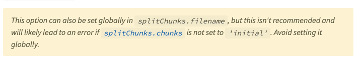
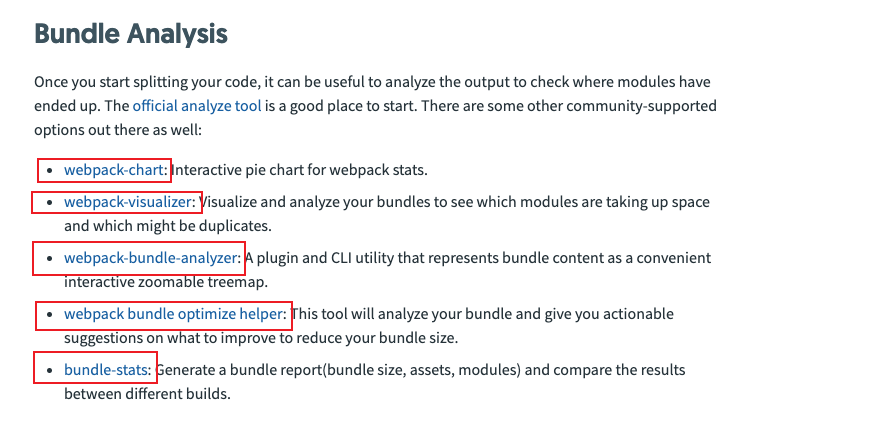
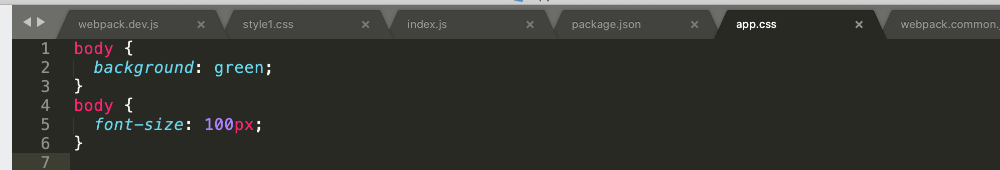
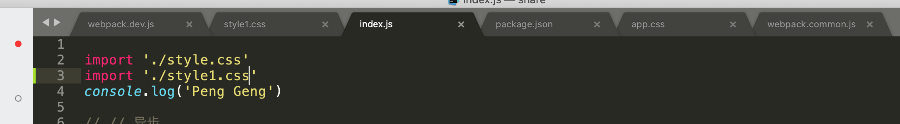
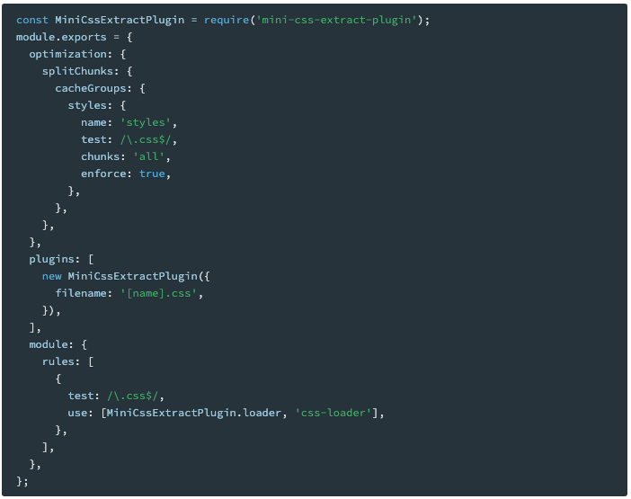
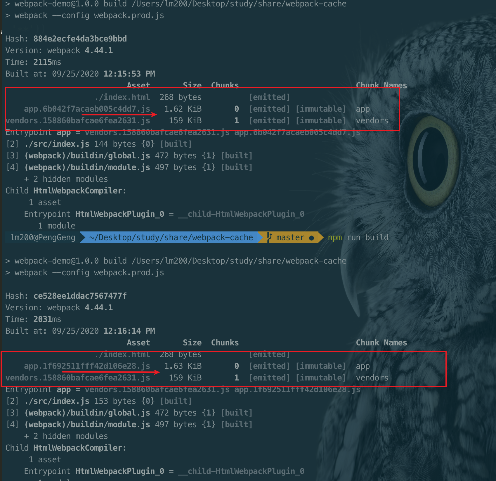

#<center>Webpack</center>
<div align='right'><font size='4' color='blue'>Author: Peng Geng</font></div>
## 1. webpack分享图谱


## 2. 原始写法和模块化写法
### 2.1 原始写法
* **touch index.html**
 
```javascript
// 举个例子🌰 demo-01
<div id='root'>
  <script src='./index.js'></script>
<div>

```
* **touch index.js**

```javascript
// 举个例子🌰 demo-01
const root = document.getElementById('id')
let El = document.creteateElement('div')
El.innerText = 'Peng Geng'
root.append(El)

```

### 2.1. 模块化写法 
> **ES Module**

* touch one.js

```javascript
// 举个例子🌰 `demo-01`
function One() {
	const root = document.getElementById('root')
	let one = document.createElement('div')
	one.innerText = 'Peng Geng'
	root.append(one)
}
export default One
```
* 修改原生写法 index.js

```javascript
// 举个例子🌰
import one from './one.js'
new one()
```
> **CommonJS**  <font color='red'>`自行做实验` `require 、module.exports`</font> 


## 2. what’s [webpack](https://webpack.js.org/)
### **webapck is a module bundler**
>1. 打包工具有哪些  <font color='blue'>`gulp、 grunt、 webapck`</font>
>
>2. 什么是模块打包工具
>
>3. webpack 支持的模式 <font color='blue'>` ES Module、CommonJS、AMD、CMD `</font>
>
>4. 查看webpack版本信息 `npm info webapck`
>
>5. npx webpack `index.js` 需要打包的入口

## 3.  Configuration
### 3.1. mode  `webpack-demo02`
注：<font color='blue'>`mode` </font>在webpack4.x 的版本添加mode的属性
> **设置mode**

```js
// 举个例子🌰
module.export = {
  mode: 'production'
}
或者
运行命令
webpck --mode=production
```
* **production**

  在打包的过程中如果没有谁知mode的值，默认会是<font color='blue'>`production`</font>,webpack 自己会做很多优化
  

* **development**

  在打包的过程中mode的只，会设置为<font color='blue'>`development`</font>,启用 `NamedChunksPlugin` 和 `NamedModulesPlugin`。<br>
  
  
* **none**
  不做任何优化处理<br>
  


### 3.2. entry 
* **单入口语法** `entry: string|Array<string>`

```js
// 举个例子🌰 `webapck-demo02`
module.exports = {
  entry: './index.js'
}

或者

module.exports = {
  entry: {
   main: './index.js'
 }
}
```
* **对象语法** `entry: {[entryChunkName: string]: string|Array<string>}`

```js
// 举个例子🌰
  module.exports = {
    entry: {
      main: './index.js',
      one: './one.js',
      two: './two.js'
    }
  }
```
>  **<font color='red'>注:</font>**  webpack小于<font color='red'>4.x</font>的时候，一般抽离的vendor作为单独的包来添加到起点`entry`的配置中，然后结合 `CommonsChunkPlugin `一起使用。但在4.x的版本中优化了次选项配置，而是使用`optimization.splitChunks`选项，将vender和主入口配置分开，作为单独的一个文件。

### 3.3. output
* **`publicPath`**

>1. 指定在浏览器中所引用的输出目录对应外部用户的公开URL
>
>2. 此选项在去加载一些绝对路径的协议是活着相对路径可能会用到
>
>3. 比如：资源托管到`CDN`时，此时就必须要用到了

```js
// 举个例子🌰 `webapck-demo02`
output: {
  publicPath: '/assets/',
  chunkFilename: '[name].chunk.js'
}
// 此时页面加载的资源(js/png/css)为 /assets/4.chunk.js/background-image: url(/assets/spinner.png);

CDN:
output: {
  publicPath: https://www.cdn.com/',
  chunkFilename: '[name].chunk.js'
}
// index.html script src='https://www.cdn.com/[name].chunk.js'
```

* **`path`**

>1. 打包输出的路径  默认：<font color='red'>当前路径下的 `dist/` </font>

>2.  通常我们会设置打包路径为： <font color='red'>`path.resolve(__dirname, 'dist')`</font>

```js
// 举个例子🌰 `webapck-demo02`
const path = require('path')
module.exports = {
  output: {
    path: path.resolve(__dirname, 'dist')
  }
}
```

* **`filename`** [<font size=4>**filename配置**</font>](https://v4.webpack.js.org/configuration/output/#outputfilename)

>1. 确定输出文件的每个bundle的名字，此时会打包到<font color='blue'>`output.path`</font>对应的目录下面
>
>2. 对应单个入口的时候，此时<font color='blue'>`output.filename`</font>的值可以为<font color='blue'>`静态`</font>名称
>
>3. 一般项目的模块会很多，我们需要做动态的配置来使每个模块有对应的bundle名称


```js
 // 举个例子🌰
 module.exports = {
  filename: [name].[chunkhash:7].js
 }
```

* **`chunkFilename`**

>1. 确定非入口文件输出的 chunk 文件名称  <font color='red'>`非 entry`</font>
>2. 配置 <font color='blue'>`[name].[contenthash].js` </font>可以监听文件的变化打包时可以改变hash，如果没有改变则hash不变,后面会具体讲到 `contenthash`的作用


```js
 // 举个例子🌰
 module.exports = {
  chunkFilename: [name].[contenthash:7].js
 }
```

### 3.4. module

>* 决定如何处理项目中不同的类型的模块
>
>* <font color='blue'>`module.rules`</font> 创建模块时，匹配到的规则能够修改模块的创建方式。这些规则能够对模块（module）应用loader，或者修改解析器(parser)
>
>* <font color='blue'>`Rule.test`</font> 引用所有通过断言测试的模块, 通过test的正则做匹配合适的loader去做解析
>
>* <font color='blue'>`Rule.use`</font> 如果是需要多个loader来解析时，我们需要使用`use`以数组的形式表示如：<font color='red'> `use: ['style-loader', 'css-loader']`;</font> 如果匹配到的模块仅需要单个loader来解析时，可以直接使用<font color='red'>`loader: 'file-loader'`</font>;
>> <font color='red'>注：</font> Loaders 可以通过多个loaders已达到链式调用的效果，它们会从右到左被应用（从最后到最先配置）如：<font color='red'>`style-loader<css-loader<less-loader/sass-loader<postcss-loader`</font>
> 
>* <font color='blue'>`Rule.exclude`</font> 抛开一些不需要使用此loader解析的模块； 如：`node-module`
>
>* <font color='blue'>`Rule.include`</font> 指定设置一些需要使用此loader解析的模块； 如：`a.js`

```js
 // 举个例子🌰 `webpack-demo3`
module: {
  rules: [{
    test: '/\.css$/',
    use: ['style-loader', 'css-loader', 'postcss-loader']
  },
  {
    test: '/\.(png|gif|jpg|svg)/',
    loader: 'file-loader', // url-loader
    options: {
      name: [name]_[hash].[ext],
or
      name(file) {
        if(process.env.NODE_ENV === 'development') {
        	return '[path][name].[ext]'
        }
        return '[hash].[ext]'
      },
      outputPath: 'images/',
      limit: 1024*20
    }
  }]
}

// 针对css文件的导入另一个css文件，如果我们需要把引入的文件从下到上去用loader 解析需要修改配置
 use: ['style-loader',
  {
   loader: 'css-loader',
   importLoader: 1,
   options: {
     modules: true // 模块化样式，文件使用的样式不会有耦合的情况
   }
 } ,
 'postcss-loader']

```
> <font size='4' color='red'>注: [`postcss-loader`](https://v4.webpack.docschina.org/loaders/postcss-loader/)</font>、 <font size='4' color='red'>[`autoprefixer`](https://github.com/postcss/autoprefixer) </font>
> 
> 此时需要在`webpack.config.js` 同级目录创建touch `postcss.config.js` , 添加如下

```js
// 举个例子🌰 `webpack-demo3`
// 需要 npm install autoprefixer -D
module.exports = {
  plugins: [
    require('autoprefixer')
  ]
}
// 有些浏览器比较新的还需要做些处理,才会显示
"browserslist": [
    "> 1%",
    "last 2 versions",
    "not ie <= 8"
  ]
```

### 3.5. plugins
>* <font size='4'>[HtmlWebpackPlugin](https://github.com/jantimon/html-webpack-plugin)</font> <font color='blue'>: 会自动在打包文件里生成一个index.html 文件，并把打包生成的文件自动引入到dist文件中;
`index.html 文件是何时生成的? ` 其实plugin在打包完成后会有一些生命周期函数的钩子，然后可以处理一些特定的事情。此时的index.html就在此时创建</font>
>
>> 
```js
// 举个例子🌰 `webpack-demo05`
const HtmlWebpackPlugin = require('html-webpack-plugin')
plugins:[
  new HtmlWebpackPlugin({
  	title: '你的title',
  	template: '你自己的模版' // './index.html'如果不填写 默认会自动生成index.html
  })
]
```
>> 

>* <font size='4'>[CleanWebpackPlugin](https://github.com/johnagan/clean-webpack-plugin)</font>
>
>>
```js
 // 此插件根据版本的变化会写法上会有一定的变化
 // V3.0.0 如下：
 const { CleanWebpackPlugin } = require('clean-webpack-plugin')
 plugins: [
 	new CleanWebpackPlugin() // 默认会从你的oupu.path 来删除 在打包之前
 ]
 // V1.0.0
 const CleanWebpackPlugin = require('clean-webpack-plugin')
 plugins: [
 	new CleanWebpackPlugin(path, options) // 【path】 clean 路径；【options】配置
 ]
```
>> 
>
>* ExtractTextPlugin
>* HotModuleReplacementPlugin
>* SplitChunksPlugin

## SourceMap

>* <font color='blue'>`cheap`: </font>之提示错问文件在哪一行 反之不加入会告诉你列
>
>*  <font color='blue'>`module`: </font> 增加错误的module 提示 比如使用的一些loader plugins
>
>*  <font color='blue'>`inline`: </font> 生成的映射文件包含在打包的chunk 文件中，反之单独生产 `[chunkname].map.js`文件
>
>*  <font color='blue'>`eval`: </font>是生产eval的执行文件，是最快的
>
>*  <font color='blue'>`source-map`: </font> 生成`[chunkname].map.js` chunk的映射文件
>
>* **deveplopment**建议使用: `cheap-module-eval-source-map` 提示的错误比较全并且相对的打包速度比较快
>
>*  **production** 建议使用如果线上有遇到问题可以设置为：`cheap-module-souce-map` 或者直接不设置
> * **SourceMap** 原理： [资料1](https://segmentfault.com/a/1190000008315937)、[资料2](https://www.html5rocks.com/en/tutorials/developertools/sourcemaps/)、[资料3](http://www.ruanyifeng.com/blog/2013/01/javascript_source_map.html)、[资料4](https://www.youtube.com/watch?v=NkVes0UMe9Y)

```js
//  举个例子🌰 `webpack-demo06`
module.exports = {
  // development
  devtool: 'cheap-moudle-eval-source-map'
  // production
  devtool: 'cheap-module-source-map' // 或者不填
}
```

## webpack-dev-server
>* watch <font color='blue'>此功能可以监听代码的改变,但是改变后的内容需要手动刷新页面才会生效</font>
>
>> ```js
>> // 举个例子🌰 `webpack-demo07`
>> 命令行使用: npx webpack --watch
>> or
>> package.json -> script -> watch: webpack --watch
>> 
>> ```
>
>* [devServer](https://webpack.js.org/configuration/dev-server/) 需要依赖webpack-dev-server; 使用 [webpack-dev-server](https://webpack.js.org/guides/development/#using-webpack-dev-server)
>
>> ```js
>>  第一步: npm install webpack-dev-serve
>>  第二步: 在webpack.config.js 创建devServe的配置
>>  devServer: {
>>    contentBase: './dist',
>>    port: '9999',
>>    open: true,
>>    proxy: {
>>      'api/': 'http://localhost:1111'
>>    }
>>  }
>>  第三步: 在package.json文件中添加启动devServer的脚本
>>  start: 'webpack-dev-server --open'
>> 
>> ```
>
>* <font color='blue'>`middleware`</font> 在早期的脚手架工具中由于webpack-dev-server不是很稳定,不太好用,然后自己使用webpack-dev-middleware 和 express/koa 来监听文件的变化
>
>> ```js
>> // 具体例子 详情见: `webpack-demo07` 核心 server.js
>> const express = require('express')
>> const webpack = require('webpack')
>> const webpackDevMiddleware = require('webpack-dev-middleware')

>> const app = express()
>> const config = require('./webpack.config.js')
>> // 使用什么来编译
>> const compiler = webpack(config)
>> 
>> // 通知 express 使用 webpack-dev-middleware来监听文件变化
>> // 把webpack.config.js 配置文件作为基础配置
>> app.use(webpackDevMiddleware(compiler, {
>> 	publicPath: config.output.publicPath || '/'
>> }))
>> 
>> // 设置监听端口 
>> app.listen(8888, function(){
>>	 console.log('port 8888 start success \n')
>> })
>> 
>> ```
## <font color="blue">`HotModuleRelacement` </font> 热模块更新 他是属于webpack的一个内置插件
>* const webpack = require('webpack')
>* new webpack.HotModuleReplacementPlugin()
>
>> ```js
>> // 举个例子🌰 `webpack-demo08`
>>  devServer: {
>>    hot: true,
>>    hotOnly: true
>> }
>> // 通过监听某一个模块的变化来达到模块的热更行
>> if(module.hot){
>>	module.hot.accept('./number', ()=> {
>>		document.body.removeChild(document.getElementById('number'))
>>		number()
>>	})
>> }
>> 
>> ```
>> 

## Tree Shaking

>* 只支持ES Module 的引入模式，不支持commonJs的模式
>
>* Tree Shaking 值在<font color=red> `mode: 'development' `</font>模式是不生效的,tree shaking 只在<font color=red>`mode: 'production'`</font> 生效

```js
// 举个例子🌰 `webpack-demo09`
// development
plugins: [
  optimization: {
   usedExports: true
  }
]
update: package.json 文件
"sideEffects": false

// production
update: package.json 文件
"sideEffects": false
```

## production 和 development 配置
>  如何把 生产环境的配置和测试环境的配置单独分离出来
>> *  <font size=3 color=blue>生产配置：`prodConfig`</font>
>> 
>> ```js 
>> // 举个例子🌰 `webpack-demo10`
>> const prodConfig = {
>>	  mode: 'production',
>>	  devtool: 'cheap-module-source-map'
>> }
>> ```
>> 
>> *  <font size=3 color=blue>测试配置：`devConfig`</font>
>> 
>> ```js 
>> mode: 'development',
>>	optimization: {
>>		usedExports: true
>>	},
>>	devtool: 'cheap-module-eval-source-map',
>>	devServer: {
>>		// contentBase: path.join(__dirname, 'dist'),
>>		compress: true,
>>		port: 9999,
>>		hot: true
>>	},
>>	plugins: [
>>		// hot module replacement HMR
>>		new webpack.HotModuleReplacementPlugin()
>>	]
>> ```

## webpack 和 Code Splitting
> webpack与 Code Splitting 不是耦合的。可以单独使用，webpack让code splitting的使用更加简单
> 
>* <font color=blue>第一种方式：</font>`entry` 入口引入第三方库文件，做并行加载
>
>> ```js
>> // eg: `webpack-codeSplitting`
>> 	entry : {
>>   lodash: './src/lodash.js',
>>   app: './src/index.js'
>>  }
>>  touch lodash.js
>>  import _ from 'lodash'
>>  window._ = _;
>> ```
>
>* <font color=blue>第二种方式：Code Splitting</font> 
>
>> ```js
>>  // 此时这种方式可以自动的把引入的第三方模块抽离出单独作为一个chunk
>>  optizimation: {
>>   splitChunks: {
>>      chunks: 'all'
>>   }
>> }
>> ```
>* 第三种方式异步的加载  老的webpack可能需要使用<font color=blue>`babel-plugin-dynamic-import-webpack`</font>  ` < webpack4.3的版本` 来做异步的分割
>
>>```js
>> function asyncComponent() {
>>   return import('lodash').then(({ default: _ }) => {
>> 		const element = docuemnt.createElement('div')
>> 	     element.innerHTML = _.join(['Peng', 'Gent'], "--")
>>       return element
>>   })
>> }
>> asyncComponent().then( el => {
>>   document.body.appendChild(el)
>> })
>>```

## SplitChunksPlugin
>1.  **<font color=black>Since webpack v4, the `CommonsChunkPlugin` was removed in favor of `optimization.splitChunks`.</font>**
>2.  **<font color=black>This configuration object represents the default behavior of the `SplitChunksPlugin`.</font>**
> 
>> ```js
>>module.exports = {
>>  // eg: webpack-splitChunksPlugin
>>  optimization: {
>>    splitChunks: {
>>      chunks: 'async',  // 判断是否针对同步和异步的文件做单独打包 aysnc、all、initial
>>      minSize: 30000, // 判断包的体积大于多少才抽离单独打包 单位byte eg: 30kb
>>      maxSize: 0, // // 抽离的最大打包体积， eg：如果一个包有1MB，这里设置为 5000，拿它就会对此包做二次分割，一般没什么卵用
>>      minChunks: 1, // 模块的引用次数
>>      maxAsyncRequests: 5,
>>      maxInitialRequests: 3,
>>      automaticNameDelimiter: '~',
>>      automaticNameMaxLength: 30,
>>      name: true,
>>      cacheGroups: {
>>        vendors: {
>>          test: /[\\/]node_modules[\\/]/,  // 判断引入的库是否在node_modules 下面
>>          filename: 'vendors.js',  //(默认配置不包含这个) 匹配的条件打包出来的文件名字 chunks 必须为 initial 见图：
>>          priority: -10
>>        },
>>        default: {
>>          minChunks: 2,
>>          priority: -20,
>>          reuseExistingChunk: true
>>        }
>>      }
>>    }
>>  }
>>};
>> ```
>  <font color=red>**注:**</font> `cacheGroups.vendors.filename: 'vender.js'` 这里需要注意`chunks：initial`,如果是异步加载模块
> 
> 

## Lazy Loading、chunk

> 详情见：例子🌰: `webpack-lazyLoading`
> 
> 什么是chunk？

## Bundle Analyse
* 如图：


* 详情例子🌰：`webpack-BundleAnalyse `

> <font size=3 color=black> [官方推荐](https://github.com/webpack/analyse):  打包工具分析 **`webpack --profile --json > stats.json`** </font>
> 
> <font size=3 color=black>[推荐使用](https://github.com/webpack-contrib/webpack-bundle-analyzer)：**`webpack-bundle-analyzer`**</font>
> [文章参考](https://medium.com/the-song-of-silence/%E4%BD%BF%E7%94%A8-webpack-%E4%BB%A3%E7%A0%81%E5%88%86%E5%89%B2-%E5%92%8C-%E9%AD%94%E6%9C%AF%E6%B3%A8%E9%87%8A-%E6%8F%90%E5%8D%87%E5%BA%94%E7%94%A8%E6%80%A7%E8%83%BD-f9e45aeb08c9)

### Prefetch、Preload

> `prefetch`: <font color=blue>resource is probably needed for some navigation in the future</font>
> 
> `preload`: <font color=blue>resource might be needed during the current navigation</font>
> 
> 利用缓存带来的性能提升比较有限，如果让页面加载的js文件的利用率最高。比如：有些交互的动作出现的页面或者可以可以使用懒加载的方式来处理：**<font color=blue>coverage</font>**  `/* webpackPreFethc: true */`

## MiniCssExtractPlugin

>1. npm install --save-dev mini-css-extract-plugin [链接](https://github.com/webpack-contrib/mini-css-extract-plugin)
>
>2. const MiniCssExtractPlugin = require('mini-css-extract-plugin')
>
>3. plugins: [new MiniCssExtractPlugin()]
>
>4. module.rules
>> ```js
>> module: {
>>  rules: [
>> 	 test: \/*.css$\i,
>>     use: [MiniCssExtractPlugin.loader, 'css-loader']
>>  ]
>>}
>>```
>>如果import两个css文件此时打包出来的效果为：
>>
>>`app.css`
>>
>>
>>`index.js`
>>
>
>5. 对CSS进行压缩  `npm install --save-dev optimize-css-assets-webpack-plugin` [文档链接](https://github.com/NMFR/optimize-css-assets-webpack-plugin)
>>```js
>> // 
>> const OptimizeCssAssetsPlugin = require('optimize-css-assets-webpack-plugin');
>> 
>> optimization: {
>>   minimizer: [new OptimizeCSSAssetsPlugin({})]
>> }
>> 
>>```
>
>6. 对所有css文件打包成一个*.css 文件; 如图：
>
>
>7. 分模块对css打包 [官网参考](https://v4.webpack.js.org/plugins/mini-css-extract-plugin/)

* <font color=red>注： 抽离css文件需要 修改`mode` 在 `production`, `packag.json->sideEffects: ["*.css"]` ; `mode`在`development`不受影响可以正常抽离</font>

* <font color=red>注：`optimize-css-assets-webpack-plugin`  在测试环境`mode : development` css 不做压缩；`mode：production`</font>

```js
// 举个例子🌰：webpack-MiniCssExtractPlugin
eg: 
const OptimizeCssAssetsPlugin = require('optimize-css-assets-webpack-plugin')
const MiniCssExtractPlugin = require('mini-css-extract-plugin')
// 设置压缩css
optimization: {
		minimizer: [new OptimizeCssAssetsPlugin({})],
	}
//  提取css
new MiniCssExtractPlugin({
	 filename: '[name].css', // 同步走这里
	 chunkFilename: '[id].css', // 异步走这里
})
```
## webpack 与 浏览器缓存(Caching)
```js
   // 举个例子🌰： `webpack-cache`
   // webpack.dev.js
   output: {
     path: path.resolve(__dirname, 'dist'),
     filename: '[name].js',
     chunkfilename: '[name].js'
   }
   
   // webpack.prod.js
	output: {
	  path: path.resolve(__dirname, 'dist'),
	  filename: '[name].[contenthash].js',
	  chunkfilename: '[name].[contenthash].js'
	}
```
<font color=red>`注：`老版本的webpack会如果这样子配置`vendors`的hash值还是会有改变，因此需要做另外配置，此配置对新的webpack版本不会有影响</font> eg：
```js
// 此时会多产生一个runtime的文件
optizimation: {
  runtimeChunk: {
    name: 'runtime'  
  }
}
```


## Babel [官网](https://babeljs.io/) <font size=4 color=red>`Babel is a JavaScript compiler.`</font>

>* npm install --save-dev babel-loader @babel/core
>* <font color=blue>`babel-loader:`</font> 通过这个使Babel 和 webpack 做连接
>* <font color=blue>`@babel/core:`</font> 是babel的核心库, 它能够让babel识别js的内容,然后把js转化成AST的抽象语法树,然后再把js编译成新的语法出来,供浏览器识别;(他提供API)
>* <font color=blue>`@babel/preset-env:`</font> 实际是这个家伙把ES6的语法转换成了ES5 (语法转义)

```js
// 举个例子🌰: `webpack-babel`
第一步: npm install --save-dev babel-loader @babel/core
第二步: 添加规则 module.rules
第三步: babel-loader 它是与webpack的沟通的桥梁,而不是来做编译的 因此
第四步: npm install @babel/preset-env --save-dev
第五步: 在业务代码中世界 import "@babel/polyfill"; 通过这种方式 他会通过全局变量的形式来注入,因此会污染全局变量; 业务模块这种方式可适用
options: {
  "presets": ["@babel/preset-env"]
}

或者

第五步: 设置"usebuiltIns": 'usage' 按需编译
options: {
  "presets": [["@babel/preset-env", {
  	 "targets": {
       "chrome": "67",
       "safari": "11.1"
     },
    "useBuiltIns": "usage",
    "corejs": "3.6.4"
  }]]
}

``` 
### transform-runtime 

>在开发一些 【库、类库、UI组件库、第三方模块】由于import "@babel/polyfill"的问题不适合,因此有了transform-runtime;
>
>npm install --save-dev @babel/plugin-transform-runtime
>
>npm install --save @babel/runtime
>
>npm install --save @babel/runtime-corejs2


```js
// 举个例子🌰 `webpack-babel`-> babel.config.js
"plugins": [["@babel/plugin-transform-runtime",{
  "absoluteRuntime": false,
  "corejs": 2,
  "helpers": true,
  "regenerator": true,
  "useESModules": false,
  "version": "7.0.0-beta.0"
}]]
```